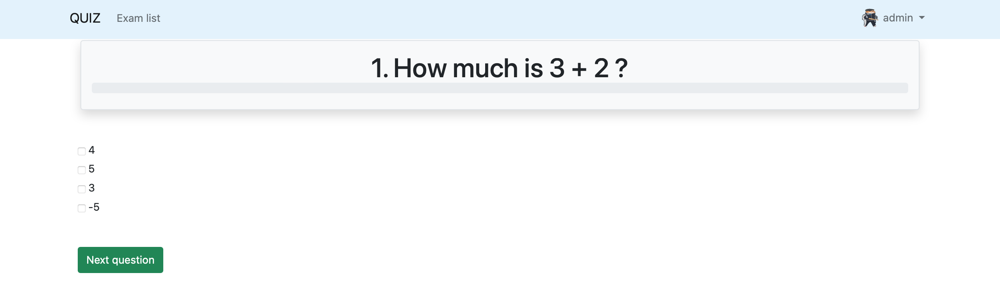

# Web Quiz App

## About

This is an online quiz app, where a user is able to pass quizzes and get points. The admin panel gives the possibility to
monitor and add / edit / delete existing quizzes. The app has authentication system as well.

## Requirements

- Python 3.8 +

## How to run
Clone the repo, install requirements with 
```shell
pip install -r requirements.txt
```
from the root directory of the project.
After dependencies are up-to-date, for database set up, please execute
````shell
python manage.py migrate
````
Then, you are able to start the project with command 
```shell
python manage.py runserver
```
A base page will be served locally at port 8000. A quizz could be created at the admin panel ```localhost:8000/admin```.
To create admin user, from a root directory execute 
```shell
python manage.py createsuperuser
```

## Preview

